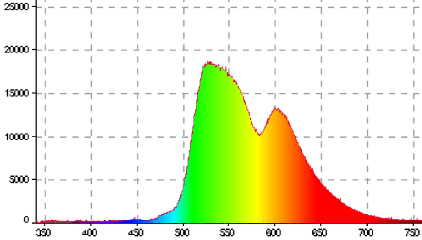

this page use to test phtot

The homomorphism $f$ is injective if and only if its kernel is only the 
singleton set $e_G$, because otherwise $\exists a,b\in G$ with $a\neq b$ such 
that $f(a)=f(b)$.